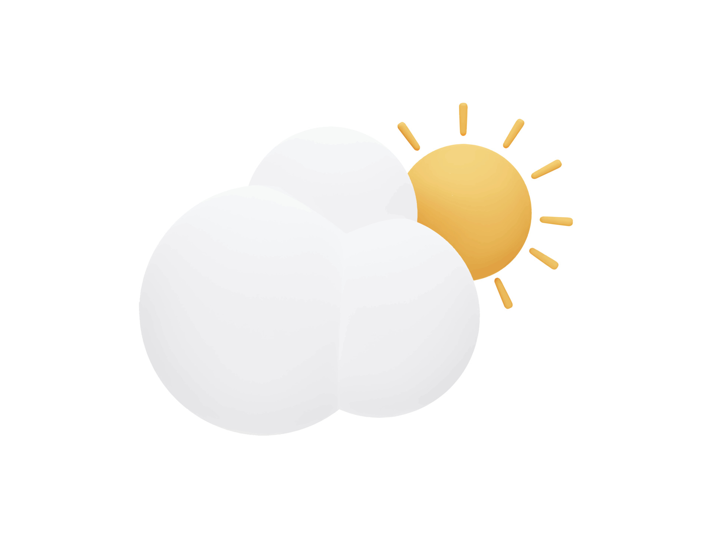

[](https://)
[](https://)


<br/>
<br/>
<div align="center">
    
    <br/>
    <br/>
    <h1 align="center">MERN Project</h1>
</div>
  <p align="center">
    Celsius to Fahrenheit converter
    <br />
    <br />
  </p>


<br/>
<br/>

<!-- TABLE OF CONTENTS -->
<details open="open">
  <summary>Table of Contents</summary>

  <ol>
    <li><a href="#illustration">Illustration</a></li>
    <li><a href="#description">Description</a></li>
    <li><a href="#languages">Languages & tools</a></li>
    <li><a href="#objectives">Objectives</a></li>
    <li><a href="#setup">SetUp</a></li>
    <li><a href="#status">Status</a></li>
    <li><a href="#context">Context</a></li>
  </ol>
</details>

<br>
<br>


## ✨ Illustration <a id="illustration"></a>


## 🗒 Description <a id="description"></a>
Practical project to improve MERN Stack.
* Back
  * API REST
* Front
  * Converter 


## 🛠 Languages/tools <a id="languages"></a>
- React / create-react-app
- NodeJS
- Express
- celsius-to-fahrenheit
- Tailwindcss


## 🎯 Objectives <a id="objectives"></a>
- Improve API REST 
- Improve small React project
- Connect together Back and Front

## 🎯 SetUp <a id="setup"></a>
- Front - React app
```
  npm start
```
- Back - Node server
```
  cd back
  node server.js
```


## 📈 Status <a id="status"></a>

Project in progress ...


## 🗓 Context <a id="context"> </a>
I realized this practical work during my bachelor of computer science in the Institute of technology of Vannes


